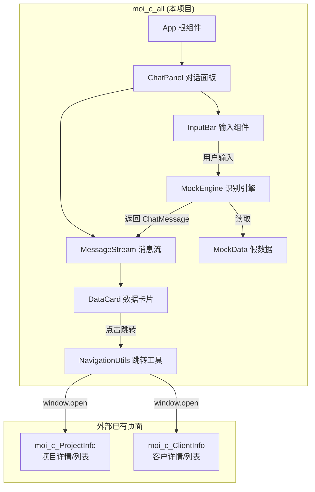
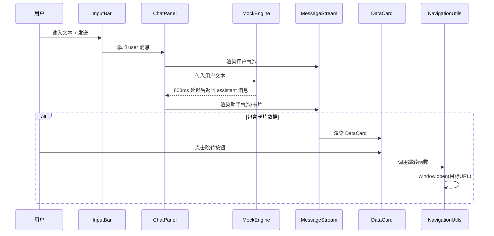

# 设计文档：合同智能体 - 信息问询功能

## 概述

本设计文档描述"合同智能体 - 信息问询"功能的前端实现方案。该功能为一个独立的 React SPA 项目（位于 `moi_c_all` 工作区），提供聊天式对话界面，用户通过自然语言输入查询项目或客户信息，系统基于前端关键词匹配返回结构化数据卡片，并支持跳转至已有的 `moi_c_ProjectInfo` 和 `moi_c_ClientInfo` 页面。

当前阶段为 Mock 驱动，不依赖后端 AI 模型。架构设计需确保未来替换为真实 AI 接口时，仅需替换数据源层，UI 组件无需重构。

### 技术栈

与 `moi_c_ProjectInfo` 保持一致：

- React 18 + TypeScript
- Vite 6（构建工具，`base: './'` 相对路径部署）
- Ant Design 6（UI 组件库）
- `@` 路径别名指向 `src/`

### 关键设计决策

1. **独立 SPA 项目**：在 `moi_c_all` 下新建完整的 Vite + React 项目，与 `moi_c_ProjectInfo` 同级部署
2. **Mock Engine 与 UI 解耦**：Mock 逻辑封装为独立模块，未来可直接替换为 API 调用层
3. **ChatMessage 标准化**：统一的消息数据结构，支持纯文本和卡片两种渲染模式
4. **window.open 跳转**：所有外部页面跳转通过新浏览器页签打开，不影响当前对话状态

## 架构

### 整体架构图



### 数据流



## 组件与接口

### 目录结构

```
moi_c_all/src/
├── App.tsx                    # 根组件
├── main.tsx                   # 入口
├── index.css                  # 全局样式
├── components/
│   ├── ChatPanel.tsx          # 对话面板（状态管理中心）
│   ├── InputBar.tsx           # 底部输入组件
│   ├── MessageStream.tsx      # 消息流列表
│   ├── MessageBubble.tsx      # 单条消息气泡
│   ├── DataCard.tsx           # 整合数据卡片
│   └── LoadingIndicator.tsx   # 加载动画
├── services/
│   └── mockEngine.ts          # Mock 关键词识别引擎
├── mocks/
│   └── data.ts                # Mock 假数据
├── types/
│   └── chat.ts                # 类型定义
└── utils/
    └── navigation.ts          # 跳转工具函数
```

### 组件接口定义

#### ChatPanel

对话面板，作为状态管理中心，持有 `messages: ChatMessage[]` 状态。

```typescript
// ChatPanel.tsx
interface ChatPanelProps {}

// 内部状态
// messages: ChatMessage[] — 聊天消息列表
// isLoading: boolean — Mock Engine 是否正在处理
```

职责：
- 管理 `messages` 状态数组
- 接收 InputBar 的用户输入，创建 user 消息并追加
- 调用 MockEngine 获取 assistant 响应，追加到 messages
- 在 loading 期间展示加载动画
- 空状态时展示欢迎提示

#### InputBar

```typescript
interface InputBarProps {
  onSend: (text: string) => void;
  disabled: boolean; // loading 期间禁用
}
```

职责：
- 维护输入框文本状态
- 展示"信息问询 ∨"下拉标签和占位符
- 支持 Enter 键和发送按钮触发 `onSend`
- 输入为空时禁用发送按钮
- 发送后清空输入框

#### MessageStream

```typescript
interface MessageStreamProps {
  messages: ChatMessage[];
  isLoading: boolean;
}
```

职责：
- 遍历 messages 渲染 MessageBubble
- 新消息时自动滚动到底部
- loading 时在底部展示 LoadingIndicator

#### MessageBubble

```typescript
interface MessageBubbleProps {
  message: ChatMessage;
}
```

职责：
- 根据 `role` 决定左/右对齐
- 根据 `cardType` 决定渲染纯文本或 DataCard

#### DataCard

```typescript
interface DataCardProps {
  cardType: 'project' | 'client';
  cardData: ProjectRecord[] | ClientRecord[];
  searchKeyword: string; // 用户原始搜索关键词，用于列表页跳转
}
```

职责：
- 渲染卡片头部（标题 + 跳转按钮）
- 渲染表格主体（Ant Design Table，纯展示无操作列）
- 表格最大 5 行可见，超出启用垂直滚动
- 动态判断跳转目标（详情页 vs 列表页）
- 可选底部来源标签

#### MockEngine

```typescript
// services/mockEngine.ts
function processUserMessage(text: string): Promise<ChatMessage>;
```

职责：
- 关键词匹配：包含"项目" → 项目卡片；包含"客户" → 客户卡片；否则 → 兜底文案
- 800ms 延迟模拟网络请求
- 返回标准 ChatMessage 对象

#### NavigationUtils

```typescript
// utils/navigation.ts
function navigateToProjectDetail(projectId: string): void;
function navigateToProjectList(keyword?: string): void;
function navigateToClientDetail(clientId: string): void;
function navigateToClientList(keyword?: string): void;
```

跳转目标路径：
- 项目详情页：`./moi_c_ProjectInfo/index.html#/project/{ProjectID}`
- 项目列表页：`./moi_c_ProjectInfo/index.html#/`
- 客户详情页：`./moi_c_ClientInfo/index.html?id={ClientID}`
- 客户列表页：`./moi_c_ClientInfo/list.html`

所有跳转通过 `window.open(url, '_blank')` 在新页签打开。


## 数据模型

### ChatMessage 接口

```typescript
// types/chat.ts

/** 消息角色 */
type MessageRole = 'user' | 'assistant';

/** 卡片类型 */
type CardType = 'project' | 'client' | null;

/** 聊天消息对象 */
interface ChatMessage {
  id: string;                          // 唯一标识（UUID 或时间戳）
  role: MessageRole;                   // 角色
  content: string;                     // 文本内容
  cardType: CardType;                  // 卡片类型，null 表示纯文本
  cardData: ProjectRecord[] | ClientRecord[] | null; // 卡片数据
  searchKeyword?: string;              // 用户原始搜索关键词（仅 assistant 消息）
  timestamp: number;                   // 消息时间戳
}
```

### 项目记录

```typescript
interface ProjectRecord {
  projectId: string;    // 项目编号，如 "P-20260316"
  projectName: string;  // 项目名称
  status: string;       // 当前状态，如 "执行中"
  manager: string;      // 负责人
}
```

### 客户记录

```typescript
interface ClientRecord {
  clientId: string;     // 客户编号，如 "C-884821"
  clientName: string;   // 客户名称
  contact: string;      // 联系人
  level: string;        // 客户级别，如 "核心 VIP"
}
```

### Mock 数据示例

```typescript
// mocks/data.ts

const MOCK_PROJECTS: ProjectRecord[] = [
  {
    projectId: 'P-20260316',
    projectName: '数据库二期扩容项目',
    status: '执行中',
    manager: '张三',
  },
  {
    projectId: 'P-20260401',
    projectName: '智能运维平台建设',
    status: '规划中',
    manager: '李四',
  },
];

const MOCK_CLIENTS: ClientRecord[] = [
  {
    clientId: 'C-884821',
    clientName: '广联达科技股份有限公司',
    contact: '李总',
    level: '核心 VIP',
  },
  {
    clientId: 'C-773512',
    clientName: '郑州地铁集团有限公司',
    contact: '王经理',
    level: '战略客户',
  },
  {
    clientId: 'C-661203',
    clientName: '北京数码视讯科技股份有限公司',
    contact: '赵总',
    level: '普通客户',
  },
];
```

### Mock Engine 关键词匹配逻辑

```typescript
// services/mockEngine.ts 核心逻辑伪代码

async function processUserMessage(text: string): Promise<ChatMessage> {
  await delay(800); // 模拟网络延迟

  if (text.includes('项目')) {
    return {
      id: generateId(),
      role: 'assistant',
      content: '为您找到与该关键词相关的 2 个项目信息。',
      cardType: 'project',
      cardData: MOCK_PROJECTS,
      searchKeyword: text,
      timestamp: Date.now(),
    };
  }

  if (text.includes('客户')) {
    return {
      id: generateId(),
      role: 'assistant',
      content: '为您匹配到相关的 3 份客户档案记录。',
      cardType: 'client',
      cardData: MOCK_CLIENTS,
      searchKeyword: text,
      timestamp: Date.now(),
    };
  }

  // 兜底
  return {
    id: generateId(),
    role: 'assistant',
    content: '抱歉，测试阶段我仅支持通过包含\'项目\'或\'客户\'的关键词进行模拟查询，请重新输入。',
    cardType: null,
    cardData: null,
    searchKeyword: text,
    timestamp: Date.now(),
  };
}
```

### 动态路由跳转逻辑

DataCard 组件根据卡片数据中的 ID 唯一性决定跳转目标：

```typescript
// DataCard 内部跳转逻辑

function getNavigationAction(
  cardType: 'project' | 'client',
  cardData: ProjectRecord[] | ClientRecord[],
  searchKeyword: string
): { label: string; action: () => void } {
  if (cardType === 'project') {
    const projectIds = new Set((cardData as ProjectRecord[]).map(r => r.projectId));
    if (projectIds.size === 1) {
      const id = [...projectIds][0];
      return {
        label: '👁 查看项目详情',
        action: () => navigateToProjectDetail(id),
      };
    }
    return {
      label: '👁 查看完整列表',
      action: () => navigateToProjectList(searchKeyword),
    };
  }

  // client
  const clientIds = new Set((cardData as ClientRecord[]).map(r => r.clientId));
  if (clientIds.size === 1) {
    const id = [...clientIds][0];
    return {
      label: '👁 查看客户档案',
      action: () => navigateToClientDetail(id),
    };
  }
  return {
    label: '👁 查看完整列表',
    action: () => navigateToClientList(searchKeyword),
  };
}
```

跳转 URL 构造：

| 场景 | URL 模板 |
|------|----------|
| 项目详情 | `./moi_c_ProjectInfo/index.html#/project/{ProjectID}` |
| 项目列表 | `./moi_c_ProjectInfo/index.html#/` |
| 客户详情 | `./moi_c_ClientInfo/index.html?id={ClientID}` |
| 客户列表 | `./moi_c_ClientInfo/list.html` |

> 注：使用 `../` 相对路径，因为 `moi_c_all` 与 `moi_c_ProjectInfo`、`moi_c_ClientInfo` 为同级目录。


## 正确性属性 (Correctness Properties)

*属性是一种在系统所有有效执行中都应成立的特征或行为——本质上是对系统应做什么的形式化陈述。属性是人类可读规范与机器可验证正确性保证之间的桥梁。*

### 属性 1：消息时间排序不变量

*对于任意* 一组 ChatMessage 消息，MessageStream 渲染后的消息顺序应与按 timestamp 升序排列的顺序一致。

**验证需求：1.3**

### 属性 2：发送消息后追加并清空

*对于任意* 非空文本输入，通过发送按钮或 Enter 键触发发送后，该文本应作为 role 为 "user" 的 ChatMessage 出现在 messages 列表末尾，且输入框内容应被清空。

**验证需求：2.3, 2.4**

### 属性 3：空输入禁止发送

*对于任意* 空字符串或纯空白字符组成的输入，发送按钮应处于禁用状态，且触发发送操作不应向 messages 列表中添加任何消息。

**验证需求：2.5**

### 属性 4：Mock Engine 关键词路由

*对于任意* 用户输入文本，MockEngine 返回的 ChatMessage 应满足：若文本包含"项目"则 cardType 为 "project" 且 cardData 为非空项目数组；若文本包含"客户"则 cardType 为 "client" 且 cardData 为非空客户数组；若两者均不包含则 cardType 为 null 且 content 为兜底文案。

**验证需求：3.1, 3.2, 3.3**

### 属性 5：DataCard 标题数量一致性

*对于任意* DataCard 组件，无论 cardType 为 "project" 还是 "client"，卡片头部标题中显示的数量 N 应严格等于 cardData 数组的长度。

**验证需求：4.1, 5.1**

### 属性 6：项目表格列完整性

*对于任意* 项目数据数组，DataCard 渲染的表格应包含且仅包含"所属项目编号"、"项目名称"、"当前状态"、"负责人"四列，不包含操作列。

**验证需求：4.3**

### 属性 7：客户表格列完整性

*对于任意* 客户数据数组，DataCard 渲染的表格应包含且仅包含"客户编号"、"客户名称"、"联系人"、"客户级别"四列，不包含操作列。

**验证需求：5.3**

### 属性 8：动态跳转 — 单实体指向详情页

*对于任意* DataCard 数据，若所有记录的主键 ID（ProjectID 或 ClientID）相同，则跳转按钮文案应为"查看项目详情"或"查看客户档案"，且跳转 URL 应包含该唯一 ID 并指向对应的详情页。

**验证需求：7.1, 7.3**

### 属性 9：动态跳转 — 多实体指向列表页

*对于任意* DataCard 数据，若记录中包含多个不同的主键 ID（ProjectID 或 ClientID），则跳转按钮文案应为"查看完整列表"，且跳转 URL 应指向对应的列表页。

**验证需求：7.2, 7.4**

### 属性 10：ChatMessage 结构完整性

*对于任意* MockEngine 返回的 ChatMessage 对象，都应包含 id（非空字符串）、role（"user" 或 "assistant"）、content（字符串）、cardType（"project"、"client" 或 null）、cardData（数组或 null）字段，且当 cardType 为 null 时 cardData 也应为 null，当 cardType 非 null 时 cardData 应为非空数组。

**验证需求：8.1**

### 属性 11：消息渲染模式由 role 和 cardType 决定

*对于任意* ChatMessage，渲染结果应满足：role 为 "user" 时渲染为右对齐用户气泡；role 为 "assistant" 且 cardType 为 null 时渲染为左对齐纯文本气泡；role 为 "assistant" 且 cardType 非 null 时渲染为左对齐的结论文本加 DataCard 组合。

**验证需求：8.2, 8.3, 8.4**

## 错误处理

### 输入验证

| 场景 | 处理方式 |
|------|----------|
| 空字符串或纯空白输入 | 禁用发送按钮，不触发 MockEngine |
| 超长文本输入 | 输入框不做长度限制（Mock 阶段），未来可在 API 层限制 |

### MockEngine 错误

| 场景 | 处理方式 |
|------|----------|
| 关键词均未命中 | 返回兜底文案，cardType 为 null |
| 延迟期间用户重复发送 | InputBar 在 loading 期间 disabled，阻止重复提交 |

### 跳转错误

| 场景 | 处理方式 |
|------|----------|
| 目标页面不存在 | window.open 在新页签打开，由浏览器处理 404 |
| cardData 为空数组 | DataCard 不渲染跳转按钮（防御性编程） |

### 渲染边界

| 场景 | 处理方式 |
|------|----------|
| 表格数据超过 5 行 | 表格内部启用垂直滚动，卡片高度固定 |
| cardData 字段缺失 | 使用默认值 "-" 填充缺失字段 |

## 测试策略

### 测试框架

- **单元测试 + 组件测试**：Vitest + React Testing Library
- **属性测试**：fast-check（JavaScript/TypeScript 属性测试库）
- 每个属性测试最少运行 100 次迭代

### 属性测试 (Property-Based Tests)

每个正确性属性对应一个属性测试，使用 fast-check 生成随机输入：

| 属性 | 测试描述 | 生成器 |
|------|----------|--------|
| P1 | 消息时间排序不变量 | 生成随机 ChatMessage 数组，验证排序 |
| P2 | 发送消息后追加并清空 | 生成随机非空字符串，验证消息追加和输入清空 |
| P3 | 空输入禁止发送 | 生成随机空白字符串（空格、制表符等），验证发送被阻止 |
| P4 | Mock Engine 关键词路由 | 生成随机字符串（含/不含"项目"/"客户"），验证返回的 cardType |
| P5 | DataCard 标题数量一致性 | 生成随机长度的 ProjectRecord/ClientRecord 数组，验证标题中的 N |
| P6 | 项目表格列完整性 | 生成随机 ProjectRecord 数组，验证渲染的列 |
| P7 | 客户表格列完整性 | 生成随机 ClientRecord 数组，验证渲染的列 |
| P8 | 单实体跳转 → 详情页 | 生成相同 ID 的记录数组，验证按钮文案和 URL |
| P9 | 多实体跳转 → 列表页 | 生成不同 ID 的记录数组，验证按钮文案和 URL |
| P10 | ChatMessage 结构完整性 | 生成随机输入文本，验证 MockEngine 返回的字段完整性 |
| P11 | 消息渲染模式 | 生成随机 ChatMessage（不同 role/cardType 组合），验证渲染结果 |

标签格式示例：
```typescript
// Feature: contract-agent-inquiry, Property 4: Mock Engine 关键词路由
test.prop([fc.string()], (input) => {
  // ...
}, { numRuns: 100 });
```

### 单元测试 (Unit Tests)

单元测试聚焦于具体示例、边界条件和集成点：

- **InputBar**：占位符文本正确、下拉标签存在、空状态下按钮禁用
- **DataCard**：Mock 项目数据至少 2 条、Mock 客户数据至少 3 条、表格滚动配置
- **MockEngine**：具体输入示例（如"查一下最近的项目"返回项目卡片）
- **NavigationUtils**：各跳转 URL 格式正确、window.open 被正确调用
- **ChatPanel**：空状态欢迎信息、Loading 动画在延迟期间展示
- **MessageBubble**：用户消息右对齐、助手消息左对齐

### 测试配置要求

- 属性测试库：`fast-check`
- 每个属性测试最少 100 次迭代（`numRuns: 100`）
- 每个属性测试必须以注释标注对应的设计属性编号
- 标签格式：`Feature: contract-agent-inquiry, Property {number}: {property_text}`
